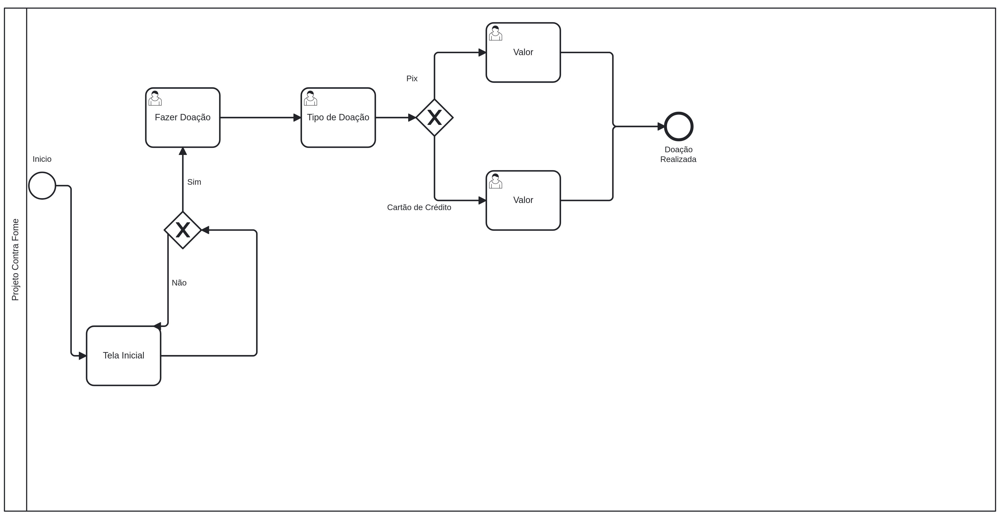
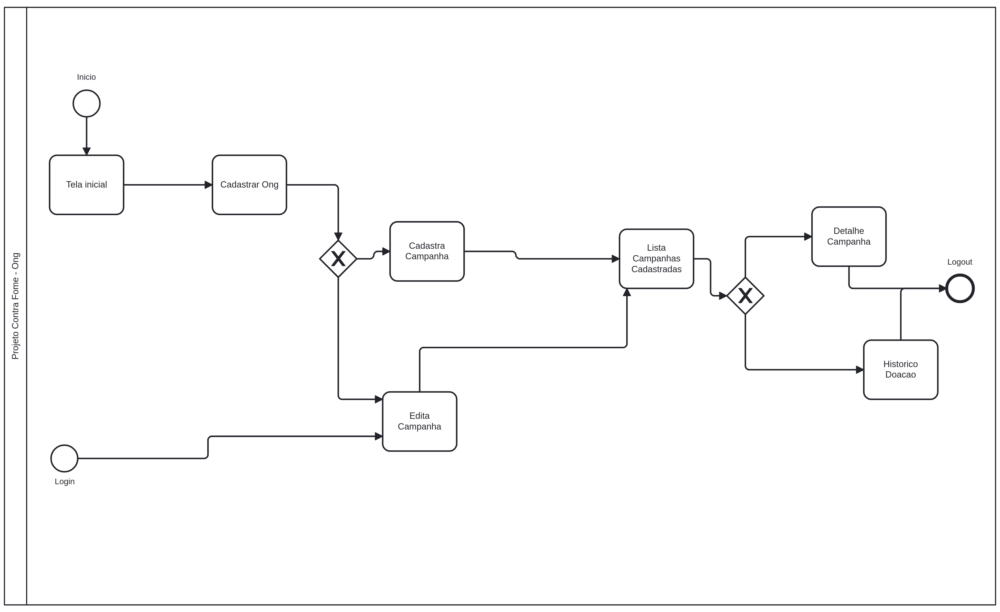
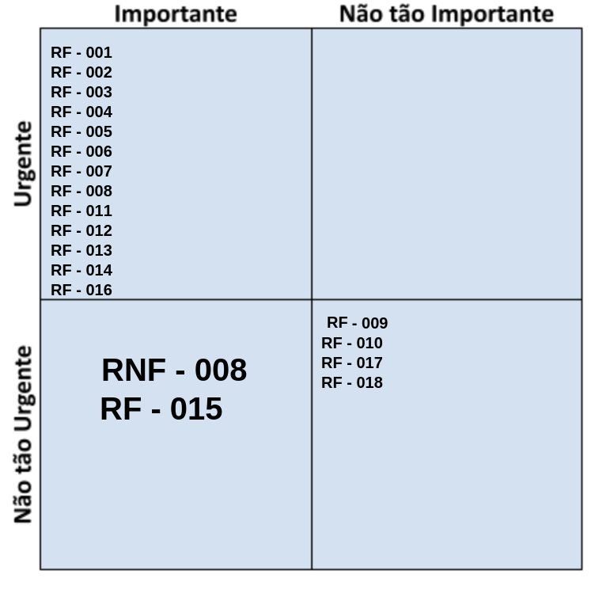
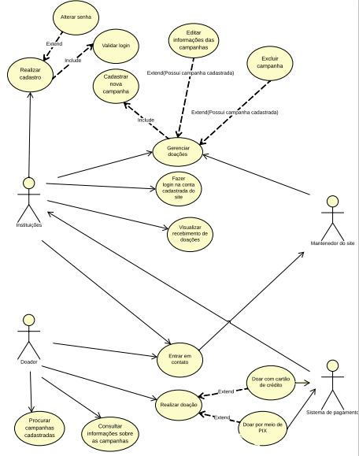
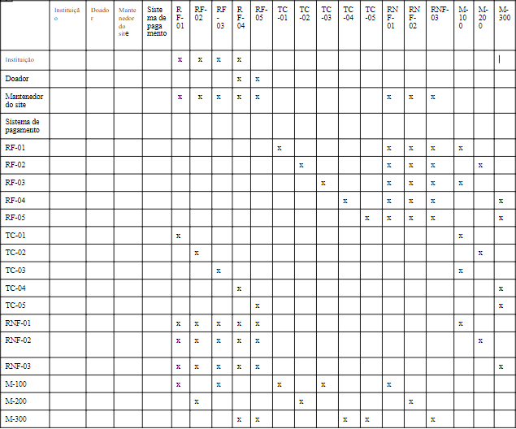
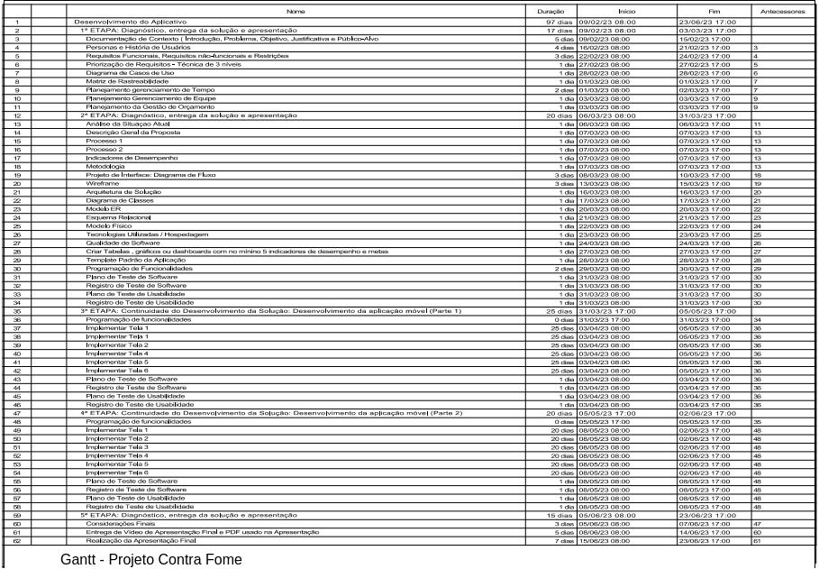
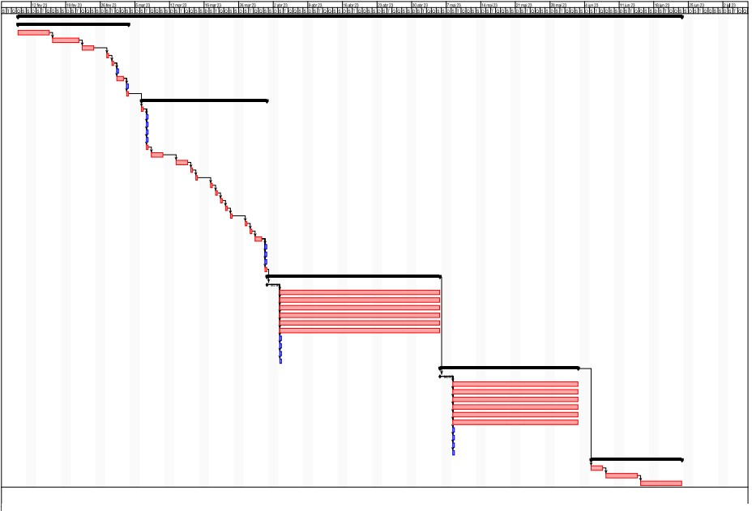
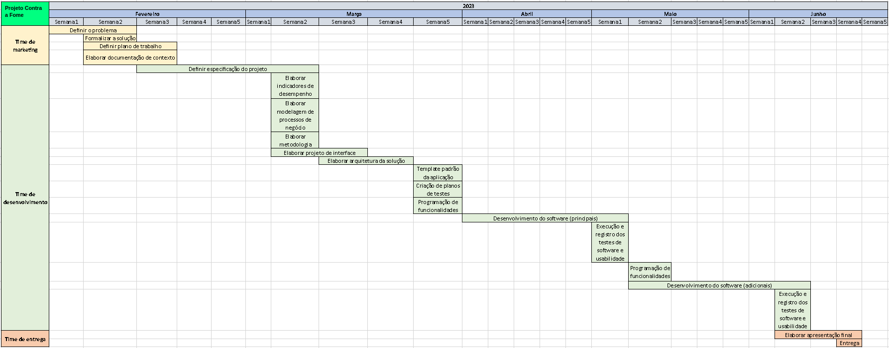
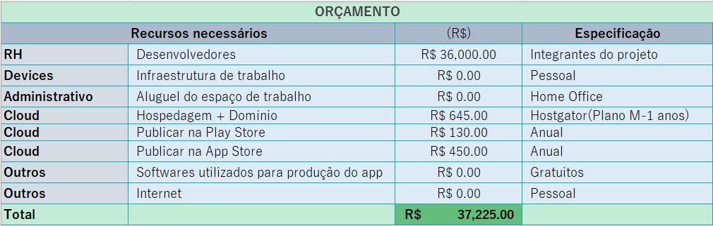

# Especificações do Projeto

A definição exata do problema e os pontos mais relevantes a serem tratados neste projeto foi consolidada através de reuniões periódicas entre os integrantes do grupo, praticando um brainstorming, trabalho de pesquisa em reportagens e publicações acadêmicas. Os detalhes levantados nesse processo foram consolidados na forma de personas e histórias de usuários.

## Personas

As personas levantadas durante o processo de entendimento do problema são apresentadas nas tabelas que se seguem.

<table border="1" width="70%">
<tr>
    <th></th>
    <td></td>
</tr>
<tr>
    <th rowspan="2"></th>  
    <td colspan="2" align="right"><b>Isabela</b> </td>
</tr>
<tr>
    <td><b>Idade:</b> 35    <b>Dificuldades:</b> Sua maior dificuldade foi encontrar um APP que reúna pontos de coleta para doações de mantimentos próximos à sua residência 

          
    </td> 
     
    <td><b>Em relação ao projeto: </b> Disse que usaria uma aplicação móvel ou site que ajudasse pessoas em vulnerabilidade social a encontrarem pontos de distribuição gratuita de alimentos e refeições. O ponto de distribuição gratuita de alimentos deverá fornecer pontos de coleta para doações de mantimentos próximos a sua residência. 
    </td>  
</tr>
</table>

<table border="1" width="70%">
<tr>
    <th></th>
    <td></td>
</tr>
<tr>
    <th rowspan="2"></th> 
    <td colspan="2" align="right"><b>Carlos</b></td>
</tr>
<tr>
    <td><b>Idade:</b> 19    <b>Dificuldades:</b> Sente que necessita ajudar a combater a fome no Brasil. Para isso, considera necessário ter uma aplicação móvel que reúna todos os pontos de coleta para doação de mantimentos próximo de sua residência e próximo ao seu local de trabalho. Para ele, a aplicação deve ser amigável, acessível e bem projetada.
        
    </td> 
    <td> <b>Em relação ao projeto:</b> Apresentou entusiasmo ao saber que vai ser desenvolvido um APP que pode fornecer pontos de coleta para doações de mantimentos de forma permanente e não quando acontece algum tipo de catástrofe. 
    </td>  
</tr>

<table border="1" width="70%">
<tr>
    <th></th>
    <td></td>
</tr>
<tr>
    <th rowspan="2"></th>
    <td colspan="2" align="right"><b>Juarez</b></td>
</tr>
<tr>
    <td><b>Idade:</b> 15    <b>Dificuldades:</b> Morador da periferia e ativista, sente que precisa fazer algo para amenizar o sofrimento da população em situação de vulnerabilidade social. Sente que precisa de um APP que crie um mapa contendo pontos de mobilização social, que receba doações de alimentos e itens de necessidade básica.
        
    </td> 
    <td> <b>Em relação ao projeto:</b> Ficou super interessado e disse que usaria uma aplicação móvel que fornecesse ferramentas que viabilizassem a procura de pontos de coleta de doações.
    </td>  
</tr>

<table border="1" width="70%">
<tr>
    <th></th>
    <td></td>
</tr>
<tr>
    <th rowspan="2"></th>
    <td colspan="2" align="right"><b>Barbara</b></td>
</tr>
<tr>
    <td><b>Idade:</b> 60    <b>Dificuldades:</b> Precisa de uma aplicação segura e transparente para realizar doações financeiras a uma instituição que distribui mantimentos. 
        
    </td> 
    <td> <b>Em relação ao projeto:</b> Disse que usaria um aplicativo que fosse transparente e mostrasse para onde a sua doação estava indo, pois ela possui maior facilidade em utilizar um aplicativo no celular do que um site através do computador. 
    </td>  
</tr>
</table>

## Histórias de Usuários

Com base na análise das personas foram identificadas as seguintes histórias de usuários:

|EU COMO... `PERSONA`| QUERO/PRECISO ... `FUNCIONALIDADE` |PARA ... `MOTIVO/VALOR`                 |
|--------------------|------------------------------------|----------------------------------------|
|Isabella  | Uma aplicação que forneça pontos de coleta para doações de mantimentos próximo a minha residência | Para ajudar pessoas em vulnerabilidade social.| 
|Carlos    | Pesquisar por locais próximos à minha residência e ao meu trabalho, para que eu possa doar alimentos| Sente que necessita ajudar a combater a fome no Brasil.|
|Juarez |Um APP que contenha um mapa com pontos de mobilização social e que receba doações de alimentos e itens de necessidade básica. | Sente que precisa ajudar as pessoas que possuem vulnerabilidade social, principalmente realizando doações de itens de necessidade básica  |
|Barbara |Um aplicativo seguro e transparente para realizar doações financeiras a uma instituição que distribui mantimentos.|Ajudar o próximo através de doações financeiras.|

## Processo Proposto - PROJETO CONTRA FOME - Todo mundo ajudando um pouco, ajuda o outro

Nesse processo, o usuário pode ou não efetuar doações

## Processo Proposto - PROJETO CONTRA FOME - Todo mundo ajudando um pouco, ajuda o outro
Nesse processo, a Ong pode fazer o login para gerenciar campanhas cadastradas, doações e dados cadastrais

## Requisitos

A tabela a seguir apresenta os requisitos funcionais do projeto, identificando suas respectivas prioridades de entrega.
    
### Requisitos Funcionais

|ID    | Descrição do Requisito  | Prioridade |
|------|-----------------------------------------|----|
|RF-001| O aplicativo deve permitir o cadastro de uma instituição   | ALTA | 
|RF-002| O aplicativo deve permitir o login de uma instituição   | ALTA | 
|RF-003| A aplicação deve conter um formulário de cadastro de novas campanhas para as instituições.  | ALTA |
|RF-004| A aplicação deve apresentar funcionalidades para que as instituições possam gerenciar as doações   | ALTA | 
|RF-005| A aplicação deve apresentar funcionalidades para que as instituições possam gerenciar as campahas cadastradas  | ALTA |
|RF-006| A aplicação deve conter uma notificação para confirmar o recebimento de doações.   | ALTA |
|RF-007| A aplicação deve apresentar a possibilidade de mostrar ao usuário o local de recebimento de mantimento, para o caso de doações físicas.   | ALTA | 
|RF-008| A aplicação deve permitir que dentro da conta da instituição, apareçam as opções de criar novas campanhas de recebimento de alimentos e (excluir ou editar) as campanhas cadastradas.   | MÉDIA| 
|RF-009| A aplicação deve colher o aceite do usuário para os termos de Política de Cookies / Privacidade, flutuante com alinhamento vertical inferior, e horizontal ao centro.    |MÉDIA |
|RF-010| A aplicação deve conter uma página de "Fale com Nosso Encarregado de Dados" (DPO) atendendo à LGPD, contendo um formulário colhendo nome, e-mail, telefone, assunto e texto.    |MÉDIA |
|RF-011| A aplicação deve conter uma página de "Política de Privacidade” contendo informações sobre a privacidade.  | ALTA | 
|RF-012| A  aplicação deve permitir que o usuário realize suas doações.  | ALTA | 
|RF-013| A aplicação deve validar o login da instituição.    | ALTA |
|RF-014| A aplicação deve ter a possibilidade de redefinir senha.   | ALTA |
|RF-015| A aplicação deve conter uma página de “Fale conosco”.   | BAIXA | 
|RF-016| A aplicação deve apresentar imagens que auxiliem o entendimento do leitor para cada assunto exposto no corpo da página.    | ALTA |
|RF-017| A aplicação deve apresentar um rodapé com os contatos da página, contendo telefone, Whatsapp, Instagram, e-mail.  | MÉDIA | 
|RF-018| A aplicação deve apresentar em todas as páginas, no footer, políticas de privacidade e termos de uso.. | MÉDIA | 

### Requisitos não Funcionais

A tabela a seguir apresenta os requisitos não funcionais que o projeto deverá atender, identificando suas prioridades de entrega.

|ID     | Descrição do Requisito  |Prioridade |
|-------|-------------------------|----|
|RNF-001| A aplicação deve ser responsiva, permitindo a visualização em diversos modelos de celular.  |  ALTA | 
|RNF-002| A aplicação deve ter bom nível de contraste entre os elementos da tela em conformidade.      | MÉDIA | 
|RNF-003| O aplicativo deve ser compatível com as principais plataformas do mercado (IOS, Android).    | ALTA |
|RNF-004| O desenvolvimento front-end deve ser através do framework React Native.  | ALTA | 
|RNF-005| O sistema back-end deve ser desenvolvido na linguagem C#, podendo utilizar frameworks. |ALTA |
|RNF-006| O banco de dados utilizado é o MySQL.   | MÉDIA | 
|RNF-007| A aplicação deve ter pontuação acima de 50 no requisito “Desempenho”, verificado pelo Lighthouse no navegador Google Chrome.   | MÉDIA |
|RNF-008| A aplicação  deve ter pontuação acima de 50 no requisito “Práticas Recomendadas”, verificado pelo Lighthouse no navegador Google Chrome.   | BAIXA | 
|RNF-009| A aplicação deve ter pontuação acima de 70 no requisito “Acessibilidade”, verificado pelo Lighthouse no navegador Google Chrome.  | MÉDIA |
|RNF-010| A aplicação deve ter pontuação acima de 60 no requisito “SEO”, verificado pelo Lighthouse no navegador Google Chrome.  | MÉDIA | 
|RNF-011| O sistema deverá estar disponível 24 horas por dia e 7 dias na semana. | ALTA | 

## Priorização de Requisitos
A técnica para priorização de requisitos utilizada foi a Escala de Três Níveis e a imagem abaixo retrata a análise realizada.

</th> 

## Restrições

O projeto está restrito pelos itens apresentados na tabela a seguir. 

|ID| Restrição                                             |
|--|-------------------------------------------------------|
|RE-01| A equipe não pode subcontratar o desenvolvimento do trabalho   |

## Diagrama de Casos de Uso

<tr>
    <th rowspan="2"></th>    
</tr>

# Matriz de Rastreabilidade

A matriz de rastreabilidade é uma ferramenta usada para facilitar a visualização dos relacionamento entre requisitos e outros artefatos ou objetos, permitindo a rastreabilidade entre os requisitos e os objetivos de negócio. 

<tr>
    <th rowspan="2"></th>    
</tr>

# Gerenciamento de Projeto
De acordo com o PMBoK v6 as dez áreas que constituem os pilares para gerenciar projetos, e que caracterizam a multidisciplinaridade envolvida, são: Integração, Escopo, Cronograma (Tempo), Custos, Qualidade, Recursos, Comunicações, Riscos, Aquisições, Partes Interessadas. Para desenvolver projetos um profissional deve se preocupar em gerenciar todas essas dez áreas. Elas se complementam e se relacionam, de tal forma que não se deve apenas examinar uma área de forma estanque. É preciso considerar, por exemplo, que as áreas de Escopo, Cronograma e Custos estão muito relacionadas. Assim, se eu amplio o escopo de um projeto eu posso afetar seu cronograma e seus custos.

## Gerenciamento de Tempo
Com diagramas bem organizados que permitem gerenciar o tempo nos projetos, o gerente de projetos agenda e coordena tarefas dentro de um projeto para estimar o tempo necessário de conclusão.
<tr>
    <th rowspan="2"></th>    
</tr>

O gráfico de Gantt ou diagrama de Gantt também é uma ferramenta visual utilizada para controlar e gerenciar o cronograma de atividades de um projeto. Com ele, é possível listar tudo que precisa ser feito para colocar o projeto em prática, dividir em atividades e estimar o tempo necessário para executá-las.
<tr>
    <th rowspan="2"></th>    
</tr>

## Gerenciamento de Equipe
O gerenciamento adequado de tarefas contribuirá para que o projeto alcance altos níveis de produtividade. Por isso, é fundamental que ocorra a gestão de tarefas e de pessoas, de modo que os times envolvidos no projeto possam ser facilmente gerenciados.

<tr>
    <th rowspan="2"></th>    
</tr>

## Gestão de Orçamento
O processo de determinar o orçamento do projeto é uma tarefa que depende, além dos produtos (saídas) dos processos anteriores do gerenciamento de custos, também de produtos oferecidos por outros processos de gerenciamento, como o escopo e o tempo.

<tr>
    <th rowspan="2"></th>    
</tr>
