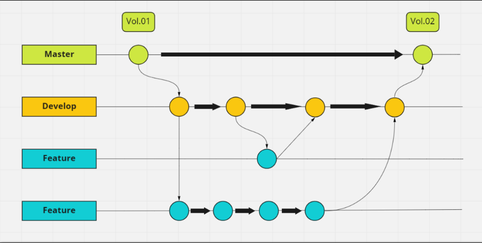
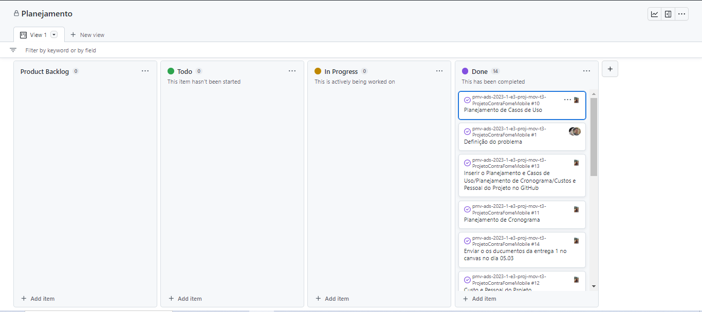
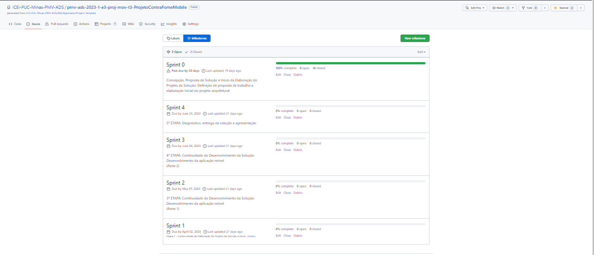

# Metodologia

Pré-requisitos: <a href="2-Especificação do Projeto.md"> Documentação de Especificação</a>

Está sendo utilizado no projeto a metodologia Ágil, através do FrameWork SCRUM. Sendo assim o grupo separou o projeto em 5 sprints e dentro de cada sprint foi listado um backlog do produto. A equipe de Desenvolvedores organiza as tarefas de cada sprint utilizando o quadro To Do / In Progress / Done.
Além de realizar uma reuião semanal de 20 minutos no intuito de cada componente explicar o que foi feito durante a última semana e o que será feito na próxima semana.

## Relação de Ambientes de Trabalho

Os artefatos do projeto são desenvolvidos a partir de diversas plataformas e a relação dos ambientes com seu respectivo propósito é apresentada na tabela que se segue.
|`AMBIENTE`| `PLATAFORMA` |`FUNCIONALIDADE`               |
|--------------------|------------------------------------|----------------------------------------|
|Repositório do código fonte  | GitHub | <a href="https://github.com/ICEI-PUC-Minas-PMV-ADS/pmv-ads-2023-1-e3-proj-mov-t3-ProjetoContraFomeMobile"> Projeto contra fome mobile/ GitHub / Códigos</a>| 
|Documentos do projeto  | GitHub |  <a href="https://github.com/ICEI-PUC-Minas-PMV-ADS/pmv-ads-2023-1-e3-proj-mov-t3-ProjetoContraFomeMobile"> Projeto contra fome mobile/ GitHub / Documentação</a>| 
|Projeto de Interface e Wireframes  | Marvel | Colocar link do marvel.| 
|Gerenciamento do Projeto | GitHub | Colocar link gerenciamento de projeto.| 

## Controle de Versão

A ferramenta de controle de versão adotada no projeto foi o [Git](https://git-scm.com/), sendo que o [Github](https://github.com) foi utilizado para hospedagem do repositório.

O projeto segue a seguinte convenção para o nome de branches:

- `main`: versão estável já testada do software
- `develop`: versão de desenvolvimento do software
- Para cada nova funcionalidade serão criadas branches locais, que posteriormente serão mergeadas à `develop` e por fim à `main`

*Exemplo da nossa gestão de código:*
 <th rowspan="2"></th> 

Quanto à gerência de issues, o projeto adota a seguinte convenção para etiquetas:

- `documentation`: melhorias ou acréscimos à documentação
- `bug`: uma funcionalidade encontra-se com problemas
- `enhancement`: uma funcionalidade precisa ser melhorada
- `feature`: uma nova funcionalidade precisa ser introduzida

As tarefas estarão distribuídas no GitHub projects, que estará estruturado da seguinte maneira:

- `Backlog`: todas as atividades que devem ser realizadas no projeto, desde a documentação até o desenvolvimento do e-commerce.
- `To-do` (O todo sempre tem que der a data alterada para o dia inicial daquela sprint semanal): o que está precisa ser feito e que foi definido previamente para aquela sprint.
- `In progress`: O que está sendo feito durante a sprint.
- `Sprint` (aqui a sprint possui a data de fim, também deve ser alterada): Nessa coluna ficam os artefatos produzidos durante a sprint em questão.
- `Test`: O que precisa ser testado.
- `Done`: Tudo o que está pronto independente da sprint.

Ao pegar uma tarefa que estará no To-do, o desenvolvedor, que já estará com o repositório clonado localmente, criará uma branch de feature.

Essa branch sera trabalhada localmente, enquanto a funcionalidade não estiver pronta. Uma vez que estiver pronta, deve-se fazer um commite e posteriormente um merge com a branch `develop`. Feito esse merge o projeto seguirá normalmente. Somente quando uma versão do projeto estiver pronta e testada que haverá um merge com da `develop` com a `main`.

## Gerenciamento de Projeto

### Divisão de Papéis

- Scrum Master: Silvia Cristina de Oliveira Teixeira;
- Product Owner: João Paulo Faria do Nascimento;
- Equipe de Desenvolvimento: Silvia Cristina, João Paulo Faria, Bianca Campos, Armando Xavier
- Equipe de Design: Silvia Cristina, João Paulo Faria, Bianca Campos, Armando Xavier

### Processo

O projeto será gerenciado pelo GitHub projects, assim como a marcação das entregas, também feita pelo próprio GitHub.

Abaixo, a forma que nosso Kanban está organizado:

 Backlog do Produto

 <th rowspan="2"></th> 
  
 
Sprints

  <th rowspan="2"></th> 

