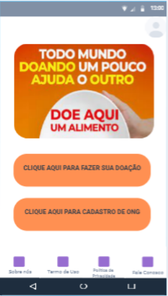

# Projeto de Interface

Pré-requisitos: <a href="2-Especificação do Projeto.md"> Documentação de Especificação</a>

Visão geral da interação do usuário pelas telas do sistema e protótipo interativo das telas com as funcionalidades que fazem parte do sistema (wireframes).

 Apresente as principais interfaces da plataforma. Discuta como ela foi elaborada de forma a atender os requisitos funcionais, não funcionais e histórias de usuário abordados nas <a href="2-Especificação do Projeto.md"> Documentação de Especificação</a>.

## Diagrama de Fluxo

  

## Wireframes

#HomePage

 

  

 

#Login

  

  

  
 

#Gerenciar Campanhas e Doações

 

  

  
 

#Cadastrar Campanha

 

  

  
 

#Editar Campanha

 

  

  
 

#Cadastrar Ong

 

  

  
 

#Termos de Uso

 

  

  
 

#Fale Conosco

 

  

  
 

#Sobre Nós

 

  

  
 

#Política de Privacidade

 

  

  
 

#Campanhas Cadastradas

 

  

  
 

#Detalhes da Campanha

 

  

  
 

#Faça Uma Doação

 

  

# Gráficos De Indicadores De Desempenho

## Indicadores de desempenho

## Avaliação dos usuários

## Quantidade De Falhas no Aplicativo em 2023
 

 ## Nota do aplicativo em 2023
 

 ## Quantas vezes o aplicativo foi desinstalado
 
