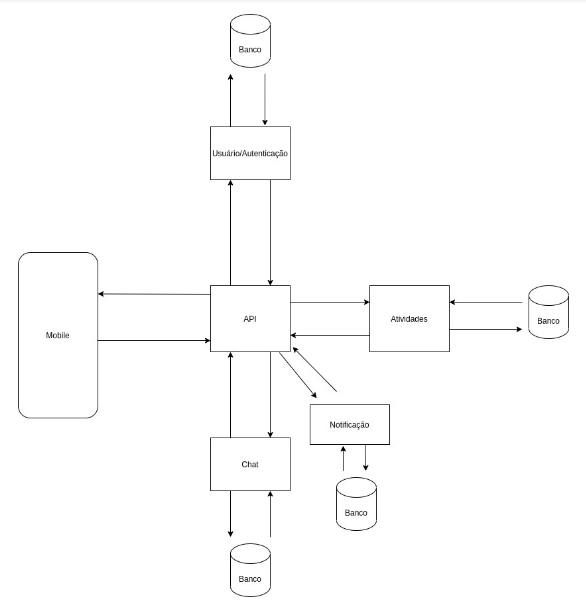
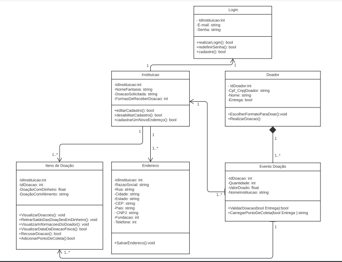
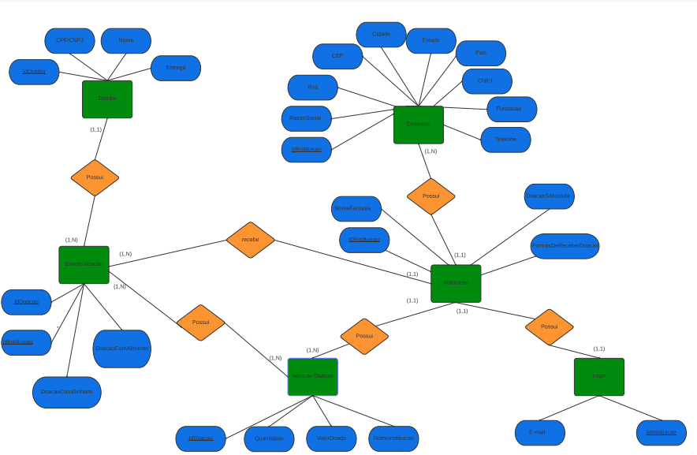
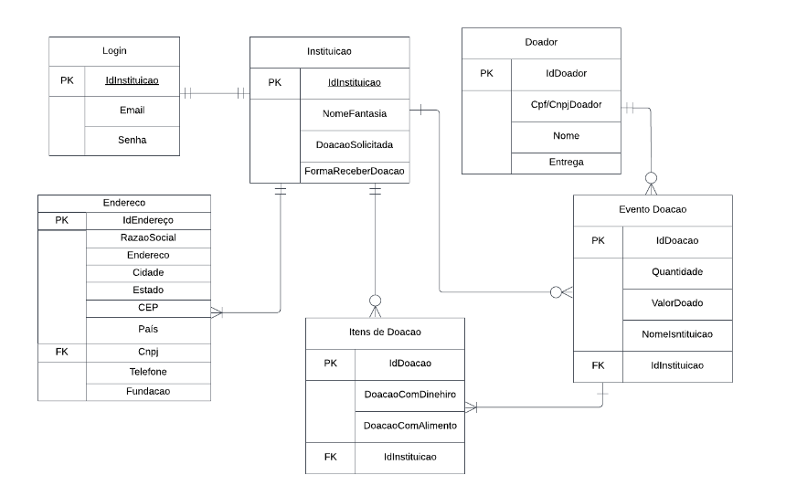

# Arquitetura da Solução

Definição de como o software é estruturado em termos dos componentes que fazem parte da solução e do ambiente de hospedagem da aplicação.

 <th rowspan="2"></th> 

## Diagrama de Classes

 <th rowspan="2"></th> 
 
## Diagrama ER 

  <th rowspan="2"></th>  
  
## Banco de Dados

  <th rowspan="2"></th> 
  

## Modelo Físico

Arquivo banco.sql contendo os scripts de criação das tabelas do banco de dados. Este arquivo está incluído dentro da pasta src\bd.
link: https://github.com/ICEI-PUC-Minas-PMV-ADS/pmv-ads-2023-1-e3-proj-mov-t3-ProjetoContraFomeMobile/blob/main/src/bd.sql

## Tecnologias Utilizadas
IDE: vscode
Ferramentas de comunicação: Teams / Discord / Whatsapp
Ferramenta para desenho de tela e diagramas: Figma / Lucidchart / Marvelapp
Criação do documento: Google Docs
Gerenciamento do Projeto: Github Projects
Repositório do código fonte: Github
Linguagens utilizadas no Front-end: Html, css, javascript
Linguagem utilizada no Back-end: C#
Framework Front-end: Bootstrap, react-native
Framework para integração entre back-end e banco de dados: Entity Framework
Banco de Dados: Microsoft SQL Server, SQLite
Servidor para banco de dados: SmarterASP.NET

O editor de código foi escolhido porque ele possui uma integração com o sistema de versão. As ferramentas de comunicação utilizadas possuem integração semelhante e por isso foram selecionadas. Por fim, para criar diagramas utilizamos essa ferramenta por melhor captar as necessidades da nossa solução.

Escolhemos o google docs como local de produção do documento. Para gestão do projeto e repositório remoto, escolhemos o GitHub pela integração com a universidade.

## Hospedagem

O Backend do APP será hospedado no SmarterASP.NET e o App será publicado na play store para downloads.

## Qualidade de Software

Conceituar qualidade de fato é uma tarefa complexa, mas ela pode ser vista como um método gerencial que através de procedimentos disseminados por toda a organização, busca garantir um produto final que satisfaça às expectativas dos stakeholders.

No contexto de desenvolvimento de software, qualidade pode ser entendida como um conjunto de características a serem satisfeitas, de modo que o produto de software atenda às necessidades de seus usuários. Entretanto, tal nível de satisfação nem sempre é alcançado de forma espontânea, devendo ser continuamente construído. Assim, a qualidade do produto depende fortemente do seu respectivo processo de desenvolvimento.

A norma internacional ISO/IEC 25010, que é uma atualização da ISO/IEC 9126, define oito características e 30 subcaracterísticas de qualidade para produtos de software.
Com base nessas características e nas respectivas sub-características, identifique as sub-características que sua equipe utilizará como base para nortear o desenvolvimento do projeto de software considerando-se alguns aspectos simples de qualidade. Justifique as subcaracterísticas escolhidas pelo time e elenque as métricas que permitirão a equipe avaliar os objetos de interesse.
|Característica de Qualidade| Subcaracterísticas |Justificativa      |
|--------------------|------------------------------------|----------------------------------------|
| ● Adequação Funcional  |         Adequação            Acurácia        Conformidade  | Prover um conjunto apropriado de funções para tarefas e objetivos do usuário especificados.    Prover, com o grau de precisão necessário, resultados ou efeitos corretos ou conforme acordados.   O software deve estar de acordo com normas, convenções ou regulamentações previstas em leis e prescrições similares relacionadas à funcionalidade.
|    ●  Eficiência de Desempenho          |   Comportamento em relação aos recursos           |  Capacidade do produto de software de usar tipos e quantidades apropriados de recursos, quando o software executa suas funções sob condições estabelecidas.
| ● Compatibilidade   |       Interoperabilidade       |   Capacidade do produto de software de interagir com um ou mais sistemas especificados.
|● Usabilidade                            |    Inteligibilidade         Apreensibilidade         Operacionalidade     |  Capacidade do produto de software de possibilitar ao usuário compreender se o software é apropriado e como ele pode ser usado para tarefas e condições de uso específicas.      Capacidade do produto de software de possibilitar ao usuário aprender sua aplicação.      Capacidade do produto de software de possibilitar ao usuário operá-lo e controlá-lo.
| ● Manutenibilidade   |   Modularidade        Analisabilidade        Modificabilidade         Testabilidade    |   A modularização (ou componentização) é o mecanismo que permite que um sistema de software seja dividido em partes que interagem entre si.      Capacidade do produto de software de permitir o diagnóstico de deficiências ou causas de falhas no software, ou a identificação de partes a serem modificadas.      Capacidade do produto de software de permitir que uma modificação especificada seja implementada.      Capacidade do produto de software de permitir que o software, quando modificado, seja validado.
| ● Portabilidade  |  Coexistência            |Capacidade do produto de software de coexistir com outros produtos de software independentes, em um ambiente comum, compartilhando recursos comuns.
| ● Confiabilidade  | Tolerância a falhas             |Capacidade do produto de software de manter um nível de desempenho especificado em casos de defeitos no software ou de violação de sua interface especificada.
| ● Segurança   |  Confidencialidade             |Capacidade do produto de software de proteger informações e dados, de forma que pessoas ou sistemas não autorizados não possam lê-los nem modificá-los e que não seja negado o acesso às pessoas ou sistemas autorizados.

|Subcaracterísticas| Métrica |Escala      |Peso      |
|--------------------|------------------------------------|----------------------------------------|----------------------------------------|
|Adequação | O sistema propõe-se a fazer o que é apropriado? |1) Não atende  2) Atende parcialmente  3) Atende completamente       |ALTO      |
|Acurácia| O sistema gera resultados corretos conforme acordado?|1) Não atende  2) Atende parcialmente  3) Atende completamente    |ALTO        |
|Conformidade| O sistema está de acordo com normas e convenções previstas em leis e descrições similares?|1) Não atende  2) Atende parcialmente  3) Atende completamente     |ALTO        |
|Comportamento em relação aos recursos| Quanto recurso o sistema utiliza? |1) Pouco  2) Suficiente  3) Muito       |ALTO        |
|Interoperabilidade| O sistema é capaz de interagir com os sistemas especificados? |1) Não atende  2) Atende parcialmente  3) Atende completamente      |ALTO        |
|Inteligibilidade| É fácil entender como utilizar o software ? |1) Não atende  2) Atende parcialmente  3) Atende completamente      |ALTO        |
|Apreensibilidade| É fácil aprender a usar? |1) Não atende  2) Atende parcialmente  3) Atende completamente      |ALTO        |
|Operacionalidade| É fácil de operar e controlar a operação? |1) Não atende  2) Atende parcialmente  3) Atende completamente    |ALTO        |
|Modularidade| As partes (módulos) do sistema estão integragindo entre si ? |1) Não atende  2) Atende parcialmente  3) Atende completamente     |ALTO        |
|Analisabilidade| É fácil diagnosticar eventuais problemas e identificar as causas das deficiências ou falhas? |1) Sim  2) Não       |ALTO        |
|Modificabilidade| Qual a complexidade de implementar modificações ? |1) Alta  2) Baixa  3) Média      |ALTO        |
|Testabilidade| Qual a complexidade de se validar o software ?  |1) Alta  2) Baixa  3) Média       |ALTO        |
|Coexistência| O sistema de software pode coexistir com outros produtos de software independentes ? |1) Sim  2) Não       |ALTO        |
|Tolerância a falhas | Ocorrendo falhas, o sistema está parametrizado para reagir ? |1) Sim  2) Não       |ALTO        |
|Confidencialidade | O sistema evita acesso não autorizado, acidental ou deliberado a programas de dados? |1) Sim  2) Não       |ALTO        |

