# Registro de Testes de Software

Esta seção apresenta as evidências e resultados dos testes definidos anteriormente em Plano de Testes de Software.

# TESTE DE NAVEGABILIDADE

### Navegabilidade - Home
|Registro de caso de teste: |Permite levar usuário para a home| 
| --- | --- |
| Objetivo do teste |navegabilidade |
|Passos| 1.Acessar o aplicativo através do celular. 2. Após acesso, a home deve ficar disponível no icone home|
| Caso de sucesso |Em caso de êxito, a home deverá aparecer na tela para que o usuário possa realizar consultas|

### Navegabilidade - sobre nós
|Registro de caso de teste: |Permite mostrar porque surgiu o aplicativo| 
| --- | --- |
| Objetivo do teste |navegabilidade |
|Passos| ̇1.Acessar o aplicativo através do celular. 2. Após acesso, o sobre nos deverá ficar disponível no icone sobre nos|
| Caso de sucesso |Em caso de êxito, o sobre nos deverá aparecer na tela para que o usuário possa realizar consultas|
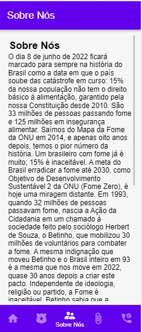

### Navegabilidade - Política de Privacidade
|Registro de caso de teste: |Realizar acesso à política de privacidade.| 
| --- | --- |
| Objetivo do teste |O sistema deverá disponibilizar para os usuários a política de privacidade do tratamento de dados pessoais.|
| Passos|1.Acessar o aplicativo através do celular. 2. Após acesso, a política de privacidade deverá ficar disponível no icone Privacidade|
| Caso de sucesso |Em caso de êxito, a política de privacidade deverá aparecer na tela para que o usuário possa realizar consultas|

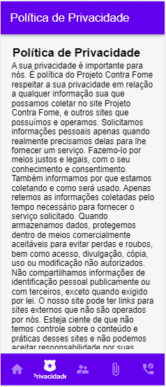

### Navegabilidade - Termo de Uso
Registro de caso de teste: |Realizar acesso ao termo de uso.| 
| --- | --- |
| Objetivo do teste |O sistema deverá disponibilizar para os usuários a política de termo de uso.|
| Passos|1.Acessar o aplicativo através do celular. 2. Após acesso, a política de termo de uso deverá ficar disponível no icone termo de uso|
| Caso de sucesso |Em caso de êxito, a política de termo de uso  deverá aparecer na tela para que o usuário possa realizar consultas|

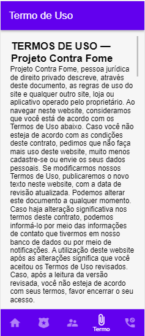

### Navegabilidade - Fale Conosco
Registro de caso de teste: |Realizar acesso à política de Fale Conosco.| 
| --- | --- |
| Objetivo do teste |O sistema deverá disponibilizar para os usuários a possibilidade de realizar contato com os desenvolvedores do site|
| Passos|1.Acessar o aplicativo através do celular. 2. Após acesso, o fale conosco deverá ficar disponível no icone parecido com um telefone|
| Caso de sucesso |Em caso de êxito,  o fale conosco deverá aparecer na tela para que o usuário possa preencher o formulario de contato e em seguida, realizar o envio do mesmo|

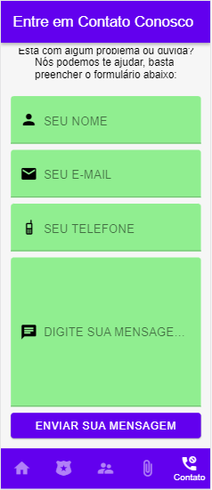

# TESTE DE LOGIN

# Teste de Login 1(Sucesso) e 2(Insucesso):
  
## Teste 1 - Realizar Login - (Caso de Sucesso)
| Registro de Caso de Teste : | Realizar login para acesso e/ou criação de contas das instituições.| 
| --- | --- |
| Objetivo do teste | Verificar se o usuário instituição consegue se cadastrar e/ou acessar o ambiente do sistema.|
| Passos(Criação do Cadastro) | 1. Acessar o aplicativo através do celular. 2. Na tela de login/cadastro, realizar o cadastro no botão destinado para o cadastro. 3. O usuário será direcionado para o formulário de cadastro. 4. Preencher os campos obrigatórios. 5. Clicar em "Cadastrar". |
| Passos(Acesso às Contas) | 1. Acessar o aplicativo através do celular. 2. Na tela de login/cadastro, realizar o realizar o login inserindo as credenciais de acesso. 3. Clicar em “Entrar”. |
| Caso de sucesso | 1. Em caso de criação de cadastro, o sistema deverá retornar uma mensagem informando o sucesso do cadastro, “Cadastro realizado com sucesso”. 2. Em caso de já existir cadastro, realizar o login com o usuário desejado, se o login funcionar corretamente, será direcionado para tela principal do sistema.  |

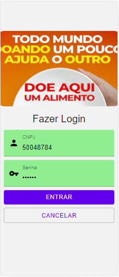

### Usuário logado - (Caso de Sucesso - TELA PRINCIPAL)
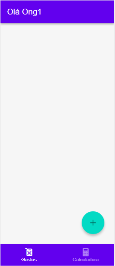

## Teste2 - Realizar Login e/ou criação de contas das instituições (Caso de Insucesso)
 Caso de Teste CT-02: | Realizar login para acesso e/ou criação de contas das instituições.| 
| --- | --- |
| Caso de insucesso - Criação do Cadastro (Restrições) |1. Ao inserir uma credencial de acesso já cadastrada o sistema deverá retornar uma mensagem de erro informando, “usuário já cadastrado”. 2. Ao inserir alguma informação inválida no formulário de cadastro, o sistema deverá informar que os dados informados são inválidos. 3. Ao deixar algum campo sem preenchimento no formulário de cadastro, o sistema não deverá permitir a continuidade do cadastro e exibir alerta, caso algum campo seja de preenchimento obrigatório.|
| Caso de insucesso Acesso às Contas (Restrições) |1. Ao inserir uma credencial não existente ou uma senha inválida o sistema deverá retornar uma mensagem de erro informando, “usuário ou senha inválidos”.  |

### Usuário Não Logado - (CNPJ inválido) - Caso de Insucesso)
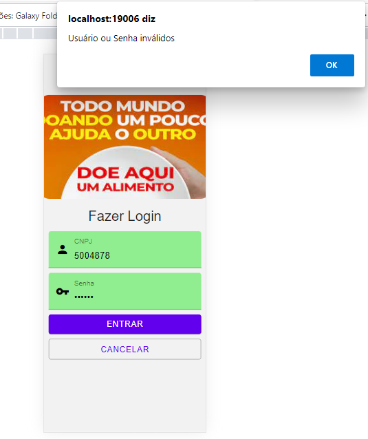

### Usuário Não Logado - (CNPJ Cadastrado) - Caso de Insucesso)
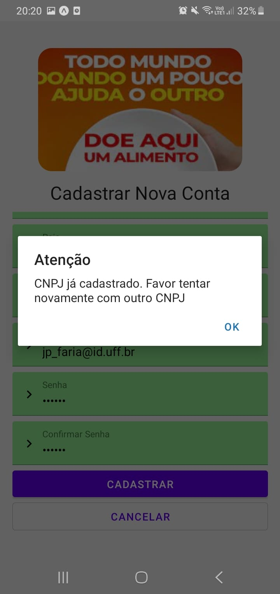

### Usuário Não Logado -  Ao inserir alguma informação inválida no formulário de cadastro, o sistema deverá informar que os dados informados são inválidos. - (Caso de Insucesso)
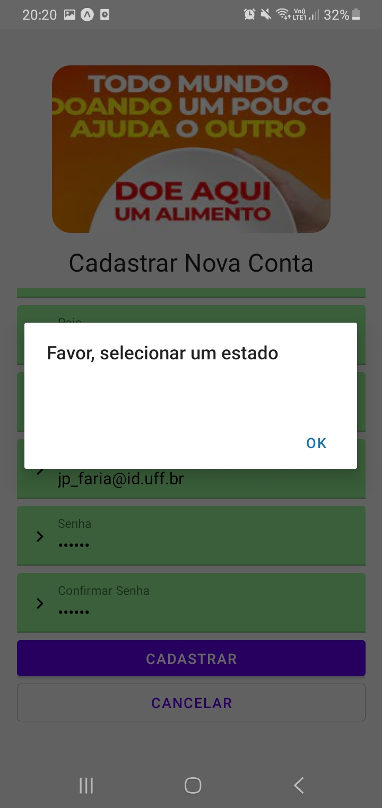

### Usuário Não Logado -  Ao deixar algum campo sem preenchimento no formulário de cadastro, o sistema não deverá permitir a continuidade do cadastro e exibir alerta, caso algum campo seja de preenchimento obrigatório.
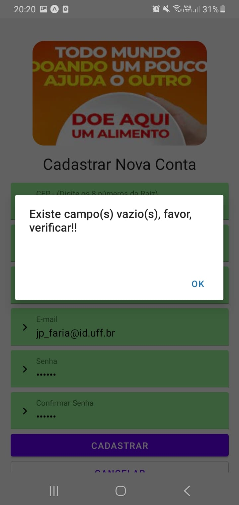

### Usuário Não Logado - (Senha inválida) - Caso de Insucesso)
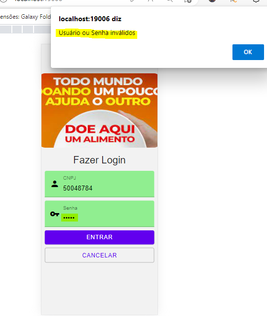

# TESTE DE GERENCIAMENTO DE CAMPANHAS CADASTRADAS

# Teste de gerenciamento de campanhas 1(Sucesso) e 2(Insucesso):
  
### Instituicao logada (Escolher campanha) - Caso de Sucesso)
|Registro de Caso de Teste:  |Realizar gerenciamento campanhas cadastradas.| 
| --- | --- |
| Objetivo do teste |Verificar se a instituição cadastrada é capaz de realizar o gerenciamento de campanhas para arrecadação. |
| Passos|1.Acessar o aplicativo através do celular. 2.Realizar o login no sistema com o usuário desejado. 3.Escolher uma campanha no qual pretende gerenciar. 4.Aparecera os detalhes da campanha no qual pretende-se editar.  |
| Caso de sucesso | Em caso de êxito, grava-se no banco de dados a campanha gerenciada .|
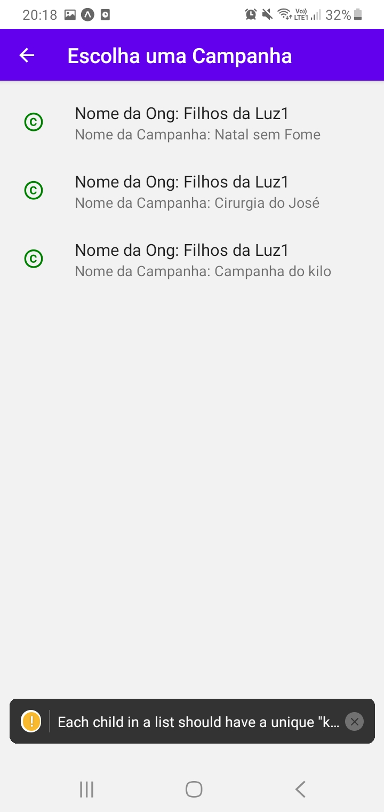
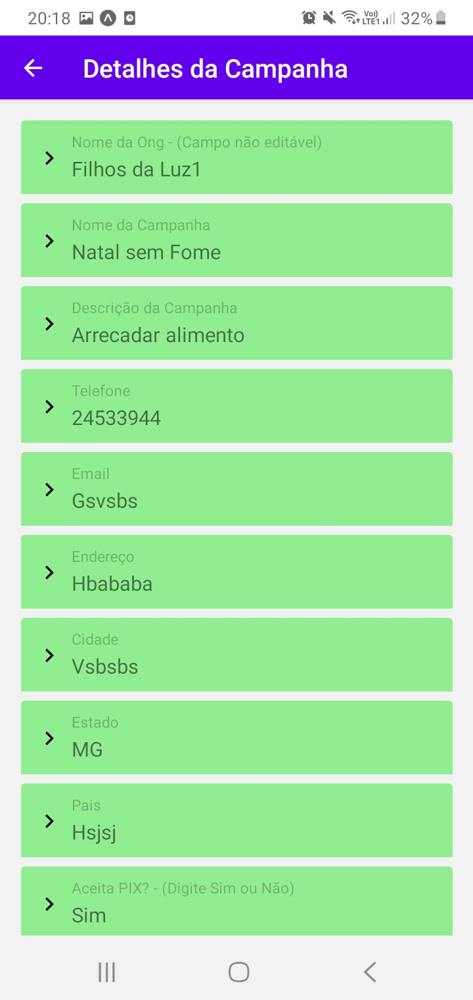
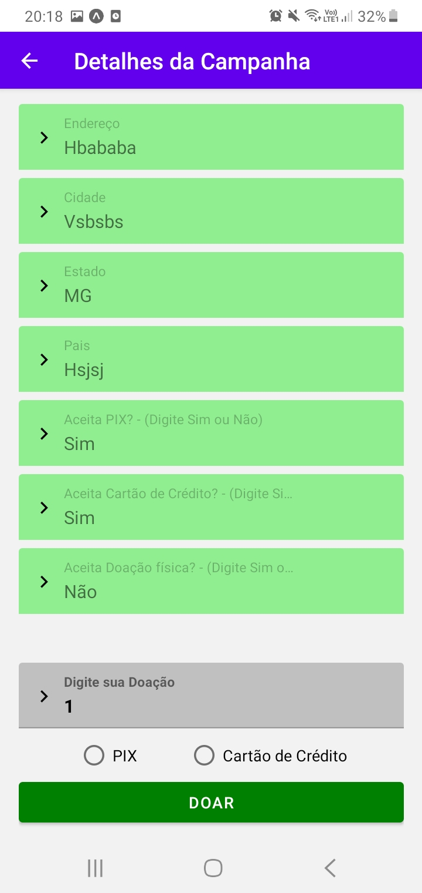

### Instituicao logada (Escolher campanha) - Caso de Insucesso)

|Registro de Caso de Teste:  |Realizar gerenciamento campanhas cadastradas.| 
| --- | --- |
| Objetivo do teste |Verificar se a instituição cadastrada é capaz de realizar o gerenciamento de campanhas para arrecadação. |
| Passos|1.Acessar o aplicativo através do celular. 2.Realizar o login no sistema com o usuário desejado. 3.Escolher uma campanha no qual pretende gerenciar. 4.Aparecera os detalhes da campanha no qual pretende-se editar.  |
| Caso de Insucesso | Em caso de insucesso, se nenhum dos campos forem preenchidos, aparecera uma mensagem de alerta, informando o erro. Com isto, impede que o usuario realize a doacao antes de retificar os mesmos.|

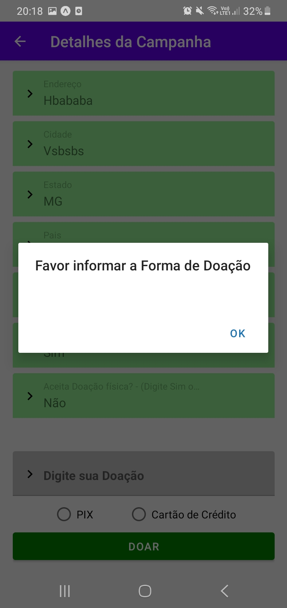

# TESTE DE GERENCIAR DOACOES

# Teste de gerenciar doacoes 1(Sucesso) e 2(Insucesso):
  

